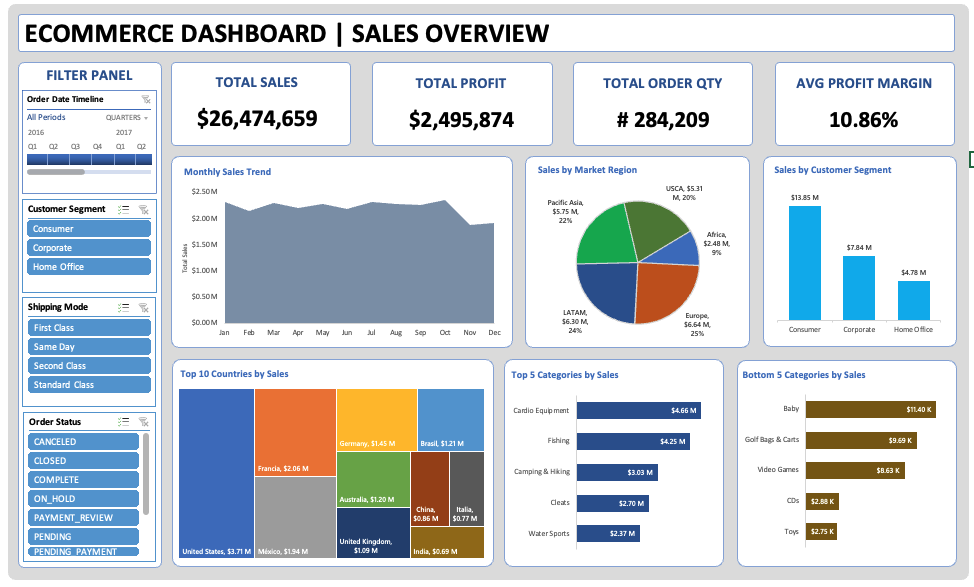

# E-Commerce Data Insights Dashboard

## Overview
This project provides a comprehensive analysis of e-commerce sales data using Excel. It includes an interactive dashboard showcasing key performance indicators (KPIs), sales trends, regional performance, and product profitability. The analysis aims to derive actionable insights that drive data-driven decision-making.

---

## Key Highlights

### 🎯 **Interactive Dashboard**
- Developed a dynamic Excel dashboard featuring:
  - **Total Sales**: $26.47M
  - **Total Profit**: $2.50M
  - **Average Profit Margin**: 10.86%
  - **Top Categories**: Fishing, Camping & Hiking, Water Sports
- Includes interactive filters for:
  - Time Periods
  - Customer Segments
  - Shipping Modes
  - Order Status

### 📊 **Actionable Insights**
1. **Top-Performing Regions**:
   - **USCA**: Contributed 59% of sales.
   - **Pacific Asia**: 26% of sales.
   - **Africa**: 15% of sales, with potential for improvement through targeted campaigns.

2. **Category Performance**:
   - **Top Categories**: Fishing ($4.25M), Camping & Hiking ($3.03M).
   - **Underperforming Categories**: Cleats ($120K), Men’s Footwear ($130K).

3. **Seasonal Trends**:
   - Sales peaked from **April to June**, suggesting opportunities to align marketing and inventory strategies with these months.

4. **Profitability Insights**:
   - Average profit margin: **10.86%**.
   - Loss-making categories like Cleats and Men’s Footwear need strategic adjustments to reduce operational inefficiencies.

---

## Files and Structure

### 📂 `data`
- **Ecommerce_Dashboard.xlsx**: The original dataset containing transaction-level information.

### 📂 `visuals`
- **Dashboard_Screenshot.png**: An image of the interactive Excel dashboard highlighting KPIs.
- **Monthly_Sales_Trend.png**: A chart showing monthly sales trends.
- **Regional_Sales_Distribution.png**: A chart depicting sales contributions by region.

### 📂 `reports`
- **Ecommerce_Insights_Report.pdf**: A detailed PDF report summarizing the analysis, findings, and recommendations.

---

## Interactive Dashboard

The interactive Excel dashboard provides a detailed view of key metrics, sales trends, and customer insights. Filters allow users to explore data by:
- Time Periods
- Regions
- Customer Segments
- Shipping Modes

---

## Methodology

1. **Data Cleaning**:
   - Managed missing values directly in Excel and ensured data consistency for accurate analysis.
2. **Analysis**:
   - Used Excel functions like `SUMIFS`, `AVERAGEIFS`, and `Pivot Tables` to calculate KPIs and derive insights.
   - Created visualizations using Excel charts for trends and regional breakdowns.
3. **Dashboard Design**:
   - Integrated slicers and dynamic charts for an interactive experience.

---

## Insights and Recommendations

### 1. Focus on High-Performing Areas
   - **USCA Region**: Continue leveraging its strong market presence, contributing 59% of sales.
   - Expand into **Pacific Asia** and **Africa** to tap into their growth potential.

### 2. Optimize Product Categories
   - Invest in high-performing categories like Fishing and Camping & Hiking.
   - Reassess inventory and pricing strategies for loss-making categories like Cleats and Men’s Footwear.

### 3. Align Marketing with Seasonal Trends
   - Increase inventory and promotional efforts from **April to June**, aligning with peak sales periods.

### 4. Improve Profit Margins
   - Address operational inefficiencies in low-margin regions and products to enhance overall profitability by 5%.

---

## Tools Used

- **Excel**: Primary tool for data analysis, visualization, and dashboard creation.

---

## How to Use

1. **Interactive Dashboard**:
   - Open the `Ecommerce_Dashboard.xlsx` file in Excel.
   - Use the slicers to filter data and explore KPIs, sales trends, and regional performance.
2. **Reports**:
   - Refer to the `Ecommerce_Insights_Report.pdf` for a comprehensive summary of findings and actionable recommendations.

---

## Next Steps

1. **Expand Analysis**:
   - Incorporate additional datasets for a multi-channel sales analysis.
2. **Automate Dashboards**:
   - Explore tools like Power BI or Tableau for real-time dashboards.
3. **Advanced Analytics**:
   - Develop predictive models to forecast sales and profitability trends.

---
